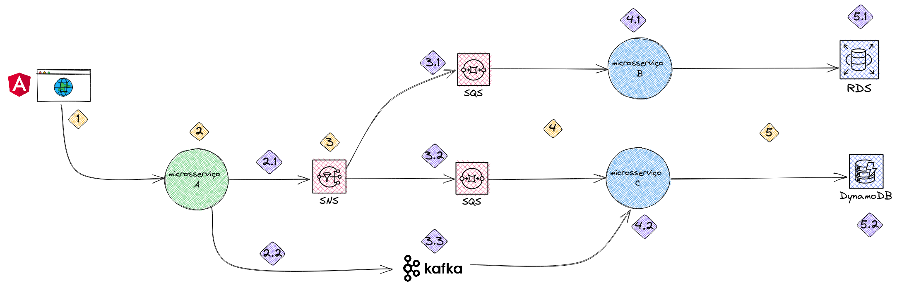

# POC-api-mensageria

## Desenho geral de arquitetura

Ferramenta utilizada para desenho: Excalidraw

## TO-DO:

 - Monitoramento com Prometheus e Grafana;
 - Tracing com Jaegger;
 - Habilitar logs;

## Fluxo detalhado

### Fase 1
- 1 - Publicada mensagem via frontend

### Fase 2

- 2.1 - O microsserviço A publicará a mensagem num tópico SNS;
- 2.2 - O microsserviço A publicará a mensagem num tópico Kafka;

### Fase 3
- 3.1 - Mensagem para a fila conectada no microsserviço B;
- 3.2 - Mensagem para a fila conectada no microsserviço C;
- 3.3 - Mensagem no tópico Kafka;

### Fase 4
- 4.1 - Mensagem recebida pelo microsserviço B;
- 4.2 - Mensagem recebida pelo microsserviço C;

### Fase 5
- 5.1 - Mensagem gravada num banco relacional (PostgreSQL);
- 5.2 - Mensagem gravada num banco não relacional (DynamoDB);

