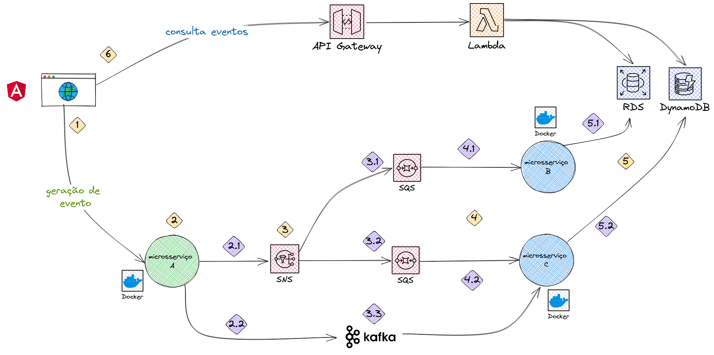
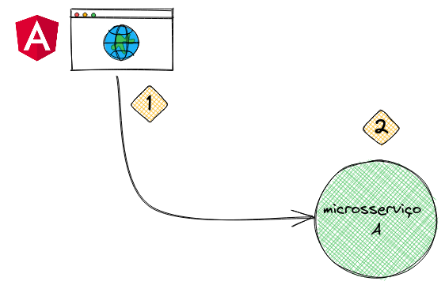
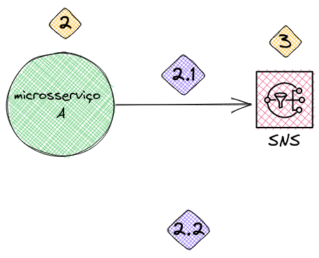
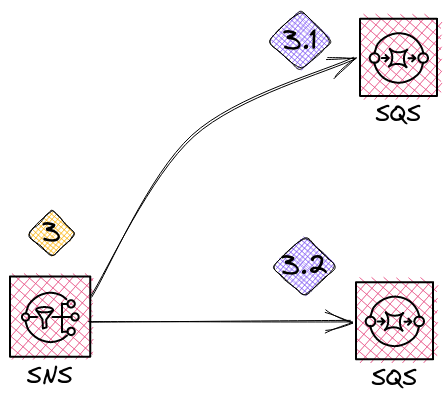
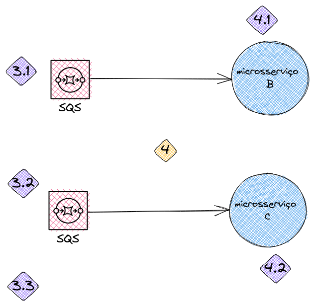
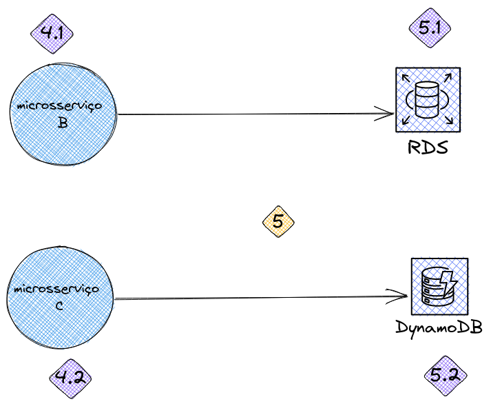
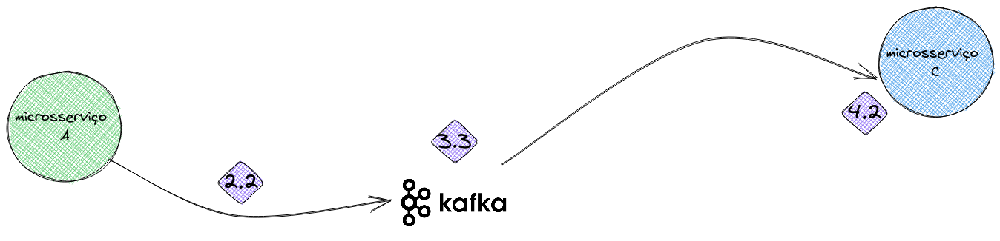
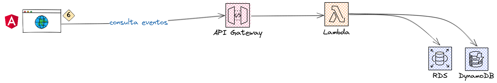

# POC-api-mensageria

## Desenho geral de arquitetura

Ferramenta utilizada para desenho: Excalidraw

## Fases de implementação

### Fase 1

    a) frontend simples para publicar evento;
    b) microsserviço simples com endpoint de publicação de evento;

### Fase 2

    a) criação de serviço para publicar mensagem no SNS;
    b) subir tópico do SNS no Localstack;
    c) publicar mensagem e testar funcionamento;

### Fase 3

    a) fazer o subscribe de duas filas no tópico SNS;
    b) ver se as filas estão recebendo as mensagens do tópico;

### Fase 4

    a) microsserviço B consome mensagens da fila;
    b) microsserviço C consome mensagens da fila;

### Fase 5

    a) microsserviço B cria item no banco de dados com mensagem;
    b) microsserviço C cria item no banco de dados com mensagem;

### Fase 6

    a) microsserviço A publica mensagem no tópico do Kafka;
    b) mensagem é consumida no microsserviço C;

### Fase 7

    a) tela de consulta de eventos;
    b) endpoint no API Gateway para consulta de eventos;
    c) Lambda para consulta de eventos nas bases de dados;

## Fluxo detalhado de funcionamento

### Momento 1
- 1 - Publicada mensagem via frontend

### Momento 2

- 2.1 - O microsserviço A publicará a mensagem num tópico SNS;
- 2.2 - O microsserviço A publicará a mensagem num tópico Kafka;

### Momento 3
- 3.1 - Mensagem para a fila conectada no microsserviço B;
- 3.2 - Mensagem para a fila conectada no microsserviço C;
- 3.3 - Mensagem no tópico Kafka;

### Momento 4
- 4.1 - Mensagem recebida pelo microsserviço B;
- 4.2 - Mensagem recebida pelo microsserviço C;

### Momento 5
- 5.1 - Mensagem gravada num banco relacional (PostgreSQL);
- 5.2 - Mensagem gravada num banco não relacional (DynamoDB);

## TO-DO:

- Monitoramento com Prometheus e Grafana;
- Tracing com Jaegger;
- Habilitar logs;
